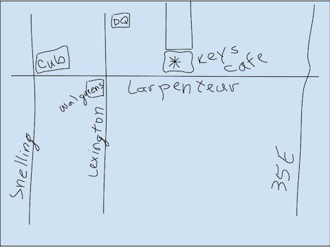
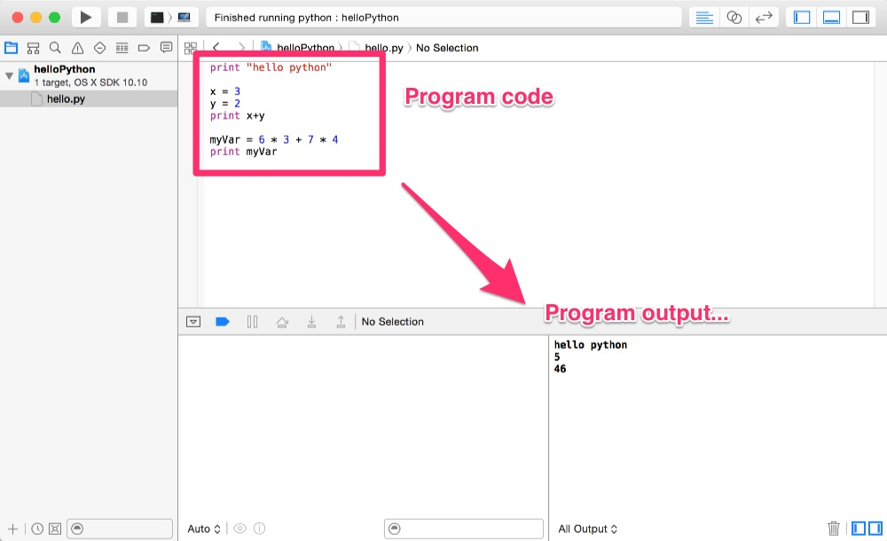
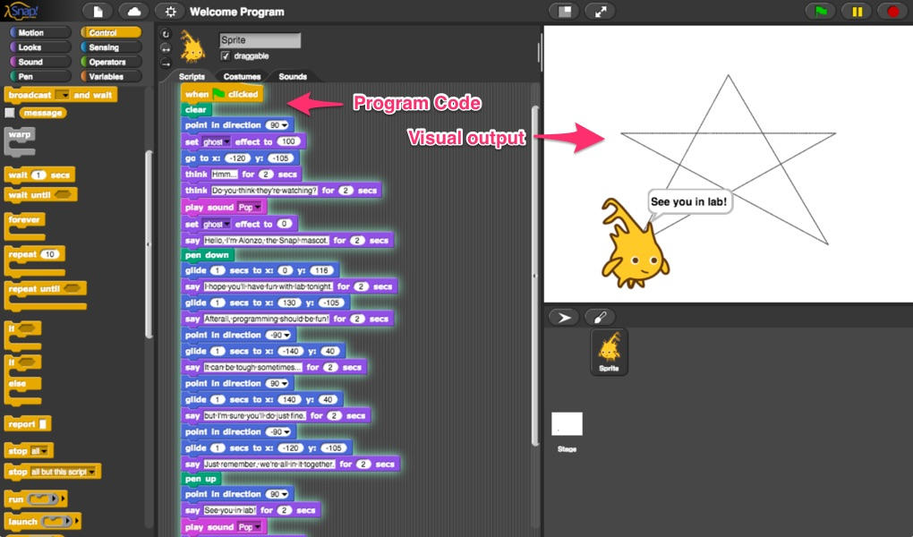

# Let's Talk Programming!
Let's take a little informal survey to start...  
(Please start with your name as you answer lecture/discussion questions.)

- What do you think programming is?  
- Who does programming?
- Where do programmers work?
- How do you think this has changed over time?
- How do you think it will change 3-5 years in the future?

<iframe width="560" height="315" src="https://www.youtube.com/embed/dU1xS07N-FA" frameborder="0" allowfullscreen></iframe>

## Computational Thinking
Throughout this course, we'll be learning to do computational thinkings.  What is computational thinking?

<blockquote>
Computational Thinking (CT) is a process that generalizes a solution to open ended problems. Open-ended problems encourage full, meaningful answers based on multiple variables, which require using decomposition, data representation, generalization, modeling, and algorithms found in Computational Thinking. ~<a href="https://en.wikipedia.org/wiki/Computational_thinking">Wikipedia</a>
</blockquote>

Put very simply, it is a way to solve a problem. It helps you find solutions for complex, open problems.  While CT is essential to the development of computer applications, it is also useful in many other disciplines.  The techniques you'll learn in this class will help you to approach solving any kind of problem in a much more productive and less frustrating way.

 In this course we'll address the following key concepts of computational thinking:

 - generalization
 - abstraction
 - composition & decomposition
 - creativity
 - data and information
 - algorithms

We'll introduce these topics in lectures and through the *Additional Resources* section that is at the end of the notes, discuss them in class, and see them in practice through the labs.  

## Introduction to Abstraction
This is the first of those key topics that we'll be discussing in this course, and you'll see it come up over and over again throughout the course in different ways.  And while we're going to put in into practice in the programs that we write, I want you to try to be conscious of where you run into this in other places in your day to day life that *may* have nothing at all to do with computing.  (Share them in the chatroom!)

We'll talk about my pets many times in this course, often rather indirectly, so let me start by introducing you to Bart.

Now, I'll bet you didn't know that I'm also a great artist.  Let me share with you my long practiced ability to draw Bart...

OK, so you can all tell that is Bart right?  Honestly, now...  Not really, right?  You could probably say with a reasonable amount of certainty that it's a cat. However, all the details that make that Bart are *abstracted* away.  Bart is distilled down into two pointy ears, two lines for eyes, a heart-shape for a nose, whiskers and a bow-tie.  

You'll see abstractions like this all over.  Someone give another example...

<blockquote>
In computer science, abstraction is a technique for managing complexity of computer systems. It works by establishing a level of complexity on which a person interacts with the system, suppressing the more complex details below the current level. ~<a href="https://en.wikipedia.org/wiki/Abstraction_(computer_science)">Wikipedia</a>
</blockquote>

You see abstraction in many ways in IT, but we're going to focus on two areas:

 - the way data is represented (network diagrams, icons on a desktop, dots on a radar, etc.)
 - the way that systems interact (communication protocols, APIs (application programming interfaces), project development methodologies)

### Data Representation
OK, quick exercise.  Draw me a map to get to your favorite restaurant.  Quick, quick... 60 seconds here...

We didn't draw every single street, did we.  Did we mark every building?  Every intersection?  How did you decide what to include?

Take a look at the same spot in [Google Maps](https://www.google.com/maps/search/map+keys+cafe+roseville+mn/@44.9914495,-93.14319,14.41z).  
What happens as you zoom in and out of the Google Map?  You get different amounts of details - levels of abstraction.  

### System Interaction
Think about driving a car.  What do you do?  Distilling it down, you go forward by pushing the gas, you stop by pushing the brake, and you turn the steering wheel to go right and left and turn around.  Right?  

Now what's going on behind the scenes to make that car go forward, stop and turn.  Anyone know?  We've got a nice simple interface to drive our cars, and what goes on under the hood, we don't have to care.  That's below the level of abstraction that we care about to drive the car.  

Another thing to think about here is that way we drive a car has been remarkably stable.  I think it's pretty safe to say that someone who drove one of those early cars could still drive a car today, because that *interface* has remained the same.  How that car actually works, the details *below the line* or under the hood, have changed a lot since those first cars, but the *interface* for driving has remained the same. This is really powerful.  By being clear about where we draw the line, and keeping the interface consistent, we can change the *implementation*, the way things work, without needing everyone to know the details and be aware of those changes.

Questions?

## Programming should be fun
My version of this course is a little different than the other sections, and is based on a curriculum in use at UC Berkeley called [The Beauty and Joy of Computing](http://bjc.berkeley.edu/website/curriculum.html).  My goal in bringing this material into our classroom is to make programming fun.  Let's be honest, many of you are just here because you have to be. You're probably not particularly excited to be here, and I want to change that. It'll make this a better experience for all of us.

Computer science and programming has an image issue.  Many people don't see this as relevant to their lives or something that they can imagine themselves doing.  It's also something that a lot of people aren't exposed to in school. (How many of you had a computer class in school? How many of you have programmed before?) My goal as an instructor is to change this.  As you leave this class, I want you to have had fun, I want you to understand how programming is relevant to you, AND I want you to pass that along to others.  

Most programing classes start with these *fun* command line programs where you enter and see lines of text. Here's something you might do in a first Python class on day 1.  (In fact we *will* be doing things like this later.)

To make this more fun, and to eliminate a LOT of early frustration, we're going to learn our early thinking (and programming) skills in a graphical block language called Snap!  This is also meant to make this a bit more fun as well write programs that you can interact with in a much more visual way.

You can view and run the whole program from here: <a href="http://snap.berkeley.edu/snapsource/snap.html#open:https://bjcredir.herokuapp.com/http://htc-ccis1505.github.io/main/assets/snap/welcomeProgram.xml" target="_blank">Snap! welcome program</a>.

BUT I'll warn you that just because it is visual, and maybe *cute*, especially if this is new to you, it is *not* easy.

Once you have mastered the *thinking* behind programming using Snap. Picking up any other language will be much easier. Because you understand the logic and structures to put together code, the language is just a tool.  Yes, there are differences between different languages, but you'll have gone through the hard part of the learning. At the end of the course, we will change from using Snap! to using Python.  Python is a *real-world*, text based language, and it is often used for scripting and procedural programming - things you are likely to do in systems administration and networking.  

## Learn by doing
I'll introduce ideas and concepts in the lectures, but you will learn programming from the labs.  Programming is something that you'll learn by doing, not by reading or listening.  It's an active, creative process that requires patience, curiosity, and persistence.  You will make mistakes, you will do things wrong, and you must be willing to accept that as absolutely normal and learn from your mistakes.  

<iframe  width="560" height="315"  src="https://www.youtube.com/embed/iPFOlXo7UPI" frameborder="0" allowfullscreen></iframe>

You will see me make mistakes in lecture demonstrations - sometimes I get quite flustered by it - but I'm getting more used to my public failures. I've been doing this a long time, and frankly I consider myself quite good at it. But we're human, we get distracted, preoccupied with other things, make bad assumptions, misunderstand how something will work, get nervous, are too tired, and sometimes we're just plain wrong. Don't let it discourage you.  Don't let it make you feel stupid.  Don't give up. Mistakes are opportunities to learn, chances to improve, growth happening right before your eyes.

## Pair Programming
For labs (and some assignments) we will be practicing a technique called pair programming.  Simply put, you take two people give them one computer, keyboard and mouse, and they work together to complete a single work assignment.  

<iframe width="560" height="315" src="https://www.youtube.com/embed/vgkahOzFH2Q" frameborder="0" allowfullscreen></iframe>

One of the extra links at the bottom of the lecture notes is a video from a Ruby conference called "Does pair programming have to suck?".  Some developers hate pairing, while others absolutely love it.  Personally, I have had some of really rotten pairing sessions, but they pale in comparison to other tales that I've heard.  At the same time, I know many people who would not work any other way.  Pairing is the highlight of their day, and they feel more productive and more vested in their work when they are pairing.

It is very rare for this to just work like magic.  Most of us do not learn how to really work with someone else, and often come to IT looking for a job where we don't have to deal with people.  Warning!  More often than not, you'll be dealing with people as much as if not more than your keyboard.  Expect a learning curve for pairing. It takes a bit of time to figure out how to work with another person, and every person is a little different.  Don't ignore problems.  If this isn't working, talk first to your pair partner, and if you can't resolve the problems between yourselves, bring them to me.

### Good Pairing Habits

1. Remember your roles:
 - The Driver's role is tactical, to focus on the mechanics of operating the computer and entering code.
 - The Navigator's role is strategic, to think about what needs to be done and plan ahead to get there.
 BUT collaborate!  If the driver is only doing literally everything the navigator says, that is just silly.  If the driver is just coding out their own ideas while the navigator watches, that's just as silly. In both extremes, there is no benefit to working together, as only one person is engaged and contributing to the work.

2. Switch roles several times during a pairing session, ideally every 10-15 minutes. After a task is complete is a good time to trade, but if a task is taking a long time, don't wait, just switch.  In a good pairing session, the keyboard should naturally flow back and forth between the two programmers. Each member of the pair should feel comfortable with asking for the keyboard as well as with pushing it aside when they're ready to switch.  

3. Be patient and respectful of your pair and where they are with their learning - whether you feel they know more of less than you.  
  - If you are the stronger member of a pair, make sure to work at a pace that your partner is comfortable with.  Make sure you are not dominating the session, and are explaining what you are doing and why. Often it can be hard to explain things that seem so obvious to us because we've done them for a long time.  Learning to put that into words is really good for you.
  - If you are the weaker member of a pair, make sure to ask questions if you don't understand what your partner is doing or why.  Make sure that you are staying engaged and contributing to the session.  You need to believe that you are adding value and follow through on contributing.  Don't be shy and don't hesitate to speak up.

4. Take breaks, and do not work ahead without your pair partner.  It is a long night.  Speak up when you need a break and agree to stop together and restart again in an agreed upon amount of time.  Be respectful of your partner and do not be late coming back.

5. It's OK to make mistakes.  Nothing is set in stone.  Anyone can change anything.  What seemed like a good idea a few minutes ago, may turn out to be a rotten idea.  Don't dwell on it, fix it and move on.

6. Disagree?  Talk it through.  Conflicts will occur, but you need to learn to work through them.  Trust me, they happen all the time.  Sometimes you need to follow through what you think is a bad idea to just try it out and let the other person see what you see. Maybe it turns out to be a fine idea and you were wrong.

7. Charm your peer.  Whether you know more or less, whether you are outgoing or shy, believe in yourself and believe in your pair.  Be confident in what you know, be honest about what you don't, and be open to ideas, discussion and learning.

### Swapping Pairs
You will choose your own pair partners, but you will need to work with multiple pair partners over the semester.  For the first 6 labs, you will stick with your partner for two labs and then switch.  Yes, even if you have a really rotten experience, you have to deal with it for two nights.  Yes, even if you and your pair hit it off really well, you have to switch.  After the first six labs, you may keep or switch your pair partners as you see fit, but you are required to work in pairs in class.  (In the case we end up with an extra person, we might have to switch things up a bit more, but we'll address this if it becomes an issue.)

### Why do we have to pair?
In the context of learning programming, pair programming allows more collaboration.  It exposes you to more ideas as you see how other people think and approach problems.  While it might seem that the stronger programmer will do all the work, when done well, both people benefit and learn from the experience. By explaining ideas and concepts, the stronger developer will strengthen and reinforce their knowledge.  Both programmers also have a sounding board for ideas and decisions giving each a better understanding of the assignment and the completed code.  

Code produced is generally of a higher quality, as *pair pressure* encourages each person to perform well.  Sometimes one person will see a simplification or a problem that the other doesn't see.  When a problem (or error) arises, what may have one person stumped may have an obvious solution to the other. More often though, it takes both people working together to think through the problem and find a solution.

### Working with others is a critical job skill
Agile development practices which are so common across the IT industry today rely on communication and strong teamwork.  While it was fairly common in the past to be fairly hands down to the keyboard and spend hours alone in your cube with your work, the Agile movement is destroying that stereotype. Cubes are being replaced with open *bull-pen* work areas.  Teams gather around a central area to work, and often teams themselves are transient, changing with each project.  The documentation that was previously painstakingly produced is now minimized and replaced by putting everyone in the same room to share requirements gathering, design, coding, testing and even deployment activities.  

Agile development does not always mean paired programming, but it is an increasingly common real world way to work.  Major Twin Cities employers practice Agile development with paired programming, and the number one skill that our industry partners are looking for is communication and your ability to work with others.  As I give references for students to employers, the number one question I am asked is how well they worked with others in the classroom.
