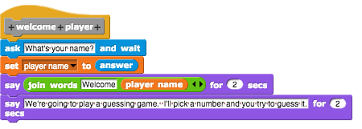
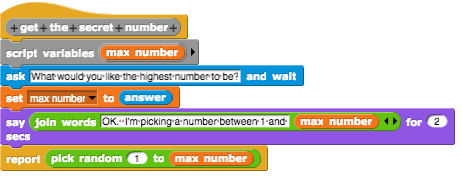
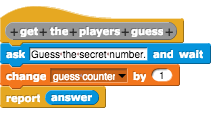
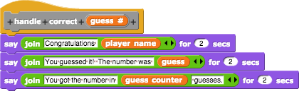
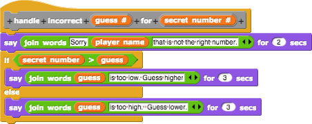
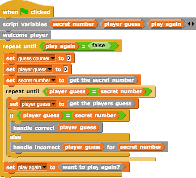

# Looking Ahead
Earlier we looked at a solution to the number guessing game.  Wonder what that might look like in "real" code?  I've mentioned that we'll be learning python later on, but let's peek ahead for a moment and see what our number game would look like written in python.

<blockquote>
Python is named after the BBC show "Monty Python's Flying Circus" and has nothing to do with reptiles. Making references to Monty Python skits in documentation is not only allowed, it is encouraged!
~<a href="https://docs.python.org/2.7/tutorial/index.html">Python Tutorial</a>
</blockquote>

## Number Game in Python
Note:  You are not expected to be able to write or run python code right now.  This is just a quick peek so that you can see how similar the code is when you translate it over to python.

### Welcome the Player
Here is how we welcomed the player in Snap!

Here is how we would welcome the player in python:


def welcome_player():
    global player_name
    player_name = input("What is your name? ")
    print("Hello " + player_name + "\n")
    print("We're going to play a guessing game. \n")
    print("I'll pick a number and you try to guess it.")


Notice that in python we make a function by using the word `def` and then indenting the code for that function.  We can "ask" the player for information by using a function called `input` which takes a message an an input parameter.  We can "say" or write a message to the player by calling a function called `print`.  We can use the `+` to "join" words (called Strings) together.

### Want to Play Again?
How about the block to see if we want to play again?

Matching code in python:


def want_to_play_again():
    answer = raw_input("Do you want to play again? ")
    if (answer == "No") | (answer == "no"):
        return False
    else:
        return True


Notice that python also has boolean values, but here they have capital letters - `True` and `False`.  We can also use if / else blocks, much like we did in Snap!  The return is like report.

### Get the Secret Number
Let's look at how we can get the secret number:

In python:


import random

def get_secret_number():
    answer = input("What should the max number be? ")
    max = int(answer)
    return random.randint(1, max)


The `int(answer)` part is checking to see that the player did guess a number.  The `random.randint` is a library function that acts like the random block in Snap!  Just like getting the for loop and list code in Snap! where we have to `Import tools` from the menu to get the blocks, in python we also have to "import" to access library functions.

### Player Guess
How about getting the player guess?

In python:

def get_player_guess():
    global guess_counter
    answer = input("Guess the secret number: ")
    guess_counter += 1
    return int(answer)


In python, we have to say when we want to change the value of a global variable, otherwise it will create a new local variable for us to use instead, and that will give us an error or cause a bug in our code when for an incorrect result.

### Handling the Player Guess
OK, so we got it, now what about doing something with it?

In python:

def handle_correct(guess):
    print("Congratulations, " + player_name + "\n")
    print("You guessed it! The number was " + str(player_guess) + "\n")
    print("You got the number in " + str(guess_counter) + " guesses.")

def handle_incorrect(guess, secret):
    print("Sorry " + player_name + " that's not the right number.")
    if secret > guess:
        print(str(guess) + " is too low. Guess higher.")
    else:
        print(str(guess) + " is too high. Guess lower.")



In python, we can say that our functions require input by adding things to the parenthesis ().  We can then use those input variables, the function parameters, in the indented code for that function.

### Pulling it Together
Now let's see it altogether as one big program.

Our main script from Snap!:
  

Complete script in python:

import random

player_name = ""
player_guess = 0

def welcome_player():
    global player_name
    player_name = raw_input("What is your name? ")
    print("Hello " + player_name + "\n")
    print("We're going to play a guessing game. \nI'll pick a number and you try to guess it.")

def want_to_play_again():
    answer = raw_input("Do you want to play again? ")
    if (answer == "No") | (answer == "no"):
        return False
    else:
        return True

def get_secret_number():
    answer = input("What should the max number be? ")
    max = int(answer)
    return random.randint(1, max)

def get_player_guess():
    global guess_counter
    answer = input("Guess the secret number: ")
    guess_counter += 1
    return int(answer)

def handle_correct(guess):
    print("Congratulations, " + player_name + "\n")
    print("You guessed it! The number was " + str(player_guess) + "\n")
    print("You got the number in " + str(guess_counter) + " guesses.")

def handle_incorrect(guess, secret):
    print("Sorry " + player_name + " that's not the right number.")
    if secret > guess:
        print(str(guess) + " is too low. Guess higher.")
    else:
        print(str(guess) + " is too high. Guess lower.")

play_again = True

welcome_player()
while play_again != False:
    guess_counter = 0
    secret_number = get_secret_number()
    while player_guess != secret_number:
        player_guess = get_player_guess()
        if player_guess == secret_number:
            handle_correct(player_guess)
        else:
            handle_incorrect(player_guess, secret_number)
    play_again = want_to_play_again()



Notice that in the python script, the function definitions aren't hidden like they are in Snap!  Also, they are all defined at the beginning of the script, then at the bottom they are used (without the word `def` in front).

### Wrap-up
This peek ahead isn't anything you need to worry too much about yet.  We still have several more topics to introduce using Snap! We'll also get you a lot more practice with the basics we've already learned before sending you off into the world of Python.

Some things to consider:

- How much of the python code could you read and understand?
- What things are a little different in python?  What things are very different?
- Why do you think we took the time to look at this now?
