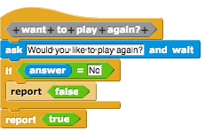
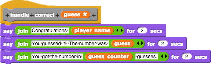
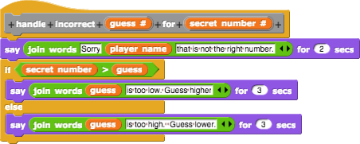
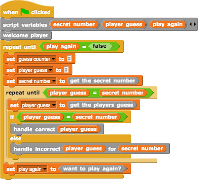

# Review using the Number Game
We've covered a fairly large chunk of information so far:

- Computing Concepts: generalization, abstraction, and composition & decomposition
- Programming Concepts: loops, blocks, booleans & conditional statements, and variables

And we can put this all into practice in the number guessing game.  

## Game Overview
The number guessing game is a simple game where the computer selects a number between 1 and some number, and the player tries to guess it.  The player can select what the max number will be. If the player guesses the number wrong, the computer will give hints to suggest that they guess either higher or lower on the next guess.

## Break Down the Problem
Let's begin by breaking down the problem into smaller pieces.

1. We need to do some set up:
   - Set up some variables
   - Get the players name & welcome them
   - Get the max number
   - Select the secret number

2. Get the players guess.

3. Check to see if it is correct:
   - if yes, tell them they won
   - if no, give them a hint

4. Repeat 2-3 until the player wins

Notice that by thinking through the problem in words, we have some ideas of where we can decompose the problem and make some custom blocks (or functions).

## Variables
Looking at the pieces we've broken out, we can start to think about the variables we might need and whether or not we want to use script variables or global variables.  

- While the suggested messages aren't shown above, most of them use the players name, so that it might be nice to have that as a global variable.  
- Also by making the guess count a global variable as well, we can bundle setting it into the "get player guess" block and use it in the win message.  
- We could do something similar with the players guess, but let's keep it a script variable to look at how we might pass the value around.
- We'll also need a variable to hold the secret number.  Let's make this a script variable as well.
- I'm also going to set up the game to ask the player if they want to play again, so we'll make a variable for this too.

## Time to Code!

### Set up
To start things off, we'll make the global variables for the player name and guess count.  Then we can start off our script with the hat block to run when the green flag is clicke and make script variables for secret number, player guess, and play again.

### Welcome
Let's make a command block to welcome the player and add that onto our main script.  While this could logically be thought of as one thing, there are a few smaller steps here:

1. Ask for the player's name so we can be polite in our messages
2. Set the global player's name variable
3. Welcome the player to the game
4. Explain how to play

### Repeat Loop
I want to be able to play the game over and over.  We'll loop or `repeat until` the player says they want to stop.  So let's set up a repeat until loop to do this, and make a block that will ask the player if they want to play again.

Because this is a yes or no question, and we want to use it to control a `repeat until` loop, we will make a predicate block.  Again, this idea of determining if we should start the game again is conceptually one thing, but there are still few smaller steps:

1. Ask the player if they want to play again
2. If they say No then report false
3. Otherwise, report true

Next we can use this to setup our main program loop.

We will add a repeat until loop to continue until play again equals false.  Before we repeat (at the end of the inner code) we'll set the play again variable to the result from this block.

### Set Variables
Each time we play again, we need to reset some variables:

- the guess counter is set to zero
- a new secret number is set
- player guess should be set to zero

Let's begin by making a block to get the secret number.  This will be a reporter block, and again it can wrap up a few smaller steps:

1. Make a script variable to hold the max number.  (This is optional, but I want you to see you can do this.)
2. Ask the player for the max number
3. Set the max number
4. Say to the player that the computer is picking a number between 1 and the max number
5. Report back a random number between 1 and the max number

This is __abstraction__ as we are hiding the details of how the secret number is chosen.  The main script doesn't need to know or care.  It just gets back the secret number.

Now we can use this block as we initialize our variables.

### Get the Player Guess
We've now wrapped up our step 1 from our broken down (or decomposed) number game logic.  Now we can move on to step 2, getting the player's guess.  We'll make a reporter block for this too.  It will:

1. Ask the player for their guess
2. Change the guess counter by one
3. Report back the result

Is this too simple for a block?  No, it is again abstracting away details - exactly how the guess is obtained. It also ensures that we always increment our guess counter when we get a new guess from the player, and it is also combining multiple blocks into a single block that is easier to read and understand.   

### Repeat Until Win
We're going to need to repeat getting the players guess and checking to see if it is correct __until__ the guess and the secret number match.  So let's update our main script to include another `repeat until`.  Then once we have checked if the player has won (which at this point won't have happened because player guess is zero), we will set the player guess variable to the value from the get player guess block.  

### Respond to the Guess
Our last step in our decomposed game logic is to check to see if the guess is correct and respond accordingly. Since there are a few steps in each case, and those steps are different, we'll break this into two smaller blocks.  In both cases, it is important to know the player's guess so we will pass that in as input to the block.  Since these blocks just *say* things, they will be command blocks.

First, let's handle a correct guess:
1. Congratulate the player
2. Tell them they guessed the correct number
3. Say how many guesses it took

The handle incorrect guess requires that we also know the secret number to give a hint to the player, so it will have an additional input.  This block will:
1. Tell the player the guess is not correct
2. If the guess is greater than the secret number then say the guess is too low, otherwise say the guess is too high

Our final step is to add this into our main script.  Notice how our final script uses __composition__ - it is composed of all the other blocks pulled together. 

To really polish things up, it might be nice to thank the player for playing the game when they are all done.

## Wrap-up
Hopefully this has helped a lot to see how your might break down a problem into smaller pieces first on paper, then by making blocks (or functions) in your code.  While the final script doesn't read like perfect english, it is fairly close, and is certainly easier to understand than if all of the code were put into one big main script.
