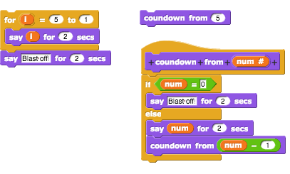
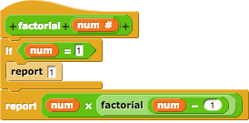
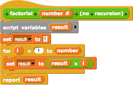

# Today's topic is recursion
Recursion is a bit like a circular definition.  It is a programming technique where a function refers to itself as part of the solution.

## Simple recursive countdown

define countdown (input_number):
  if input_number = 0, then say "Blastoff"
  else countdown(input_number - 1)

Let's put this into Snap! and compare it to a simple for loop countdown.

## Play it out
The recursive call is not quite as straight forward as the the for loop.  If we were to peek inside as it ran, it would go something like this:

- start call to countdown with input 5
- is input 0?  
- no, so say "5" and call countdown with input 4
- start call to countdown with input 4
- is input 0?  
- no, so say "4" and call countdown with input 3
- start call to countdown with input 3
- is input 0?  
- no, so say "3" and call countdown with input 2
- start call to countdown with input 2
- is input 0?  
- no, so say "2" and call countdown with input 1
- start call to countdown with input 1
- is input 0?
- no, so say "1" and call countdown with input 0
- start call to countdown with input 0
- is input 0?
- yes so say "Blast off!"
- finish call to countdown with input 1
- finish call to countdown with input 2
- finish call to countdown with input 3
- finish call to countdown with input 4
- finish call to countdown with input 5

If this seems a little crazy, that's because it is.  For this problem, a for loop is so much simpler, and more efficient in terms of memory use and performance.  The computer needs to remember all of the set up for each of those calls that get finished up at the end.  If we were counting down for weeks (like you might in a real rocket launch), imagine the size of that stack of calls at the end!

This example is however a very simple way to introduce the key parts of a recursive function call:

- the base (end) case - the one that does not refer back to itself.  
- the recursive case - calls itself with an input value that is closer to the base case.

### Base Case

We always need a way to figure out that we're done and shouldn't make the recursive call again. This is the simplest case for the problem.  Like the if 0 say Blastoff case for the countdown, it is what ends the stack of recursive calls and starts the return back through that stack to the original call.

It is very important to find the base case for a recursive problem.  Generally it is easiest to determine what the base case is first.

Note that it is possible that there is more than one base case.  That's fine.  You can have as many base cases as needed to solve the problem.

### Recursive Case
Everything that is not a base case is a recursive case.  However just like there can be more than one base case, you can also have the recursive case make more than one recursive call.  Each recursive call however needs to move the input to the function closer to a base case.

If the function does not eventually reach a base case, then it will continue to call itself forever... or until it runs the computer out of memory and crashes.  This is called infinite recursion.  As you might imagine, you don't want to cause this to happen.

## Better Recursion Example
Math is full of recursive problems to solve.  A simple one is calculating factorial of a number.  Factorial 5 or 5! is equal to 5 x 4 x 3 x 2 x 1, or the value 120.  Factorial 1 (or 1!) is 1, and that gives us our base case.

Let's put this into Snap!

### Do I Have To?
There is always a way to non-recursively solve a problem.  Let's look at a non-recursive solution to the factorial calculation above.

However, for more complex problems, the recursive solution is often easier to write and understand.
